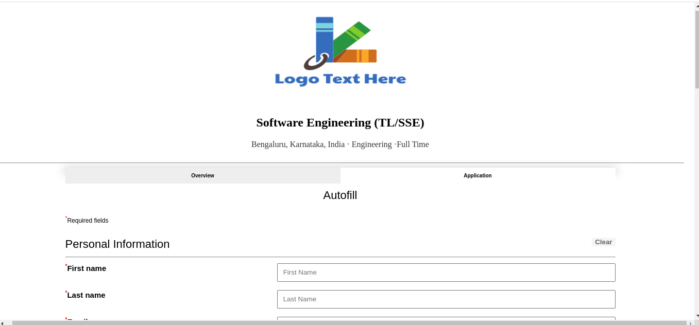
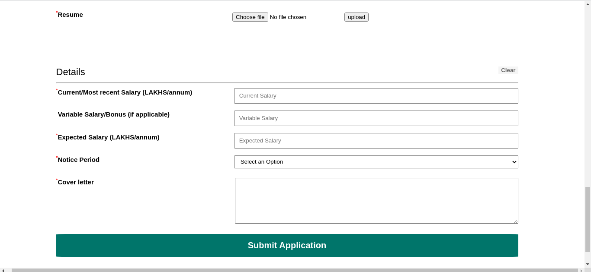

Created A Sample Webpage for applying for jobs using PHP , Mysql

Steps To run the project locally.

1. Download XAMPP (linux) and run all its servers.
2. Save the Repositary folder inside opt/lampp/htdocs/ .
3. Open phpmyadmin ( http://localhost/phpmyadmin/ ) .
4. import database.sql file (which will created required tables).
5. now run http://localhost/FOLDER_NAME/ on you browser.
